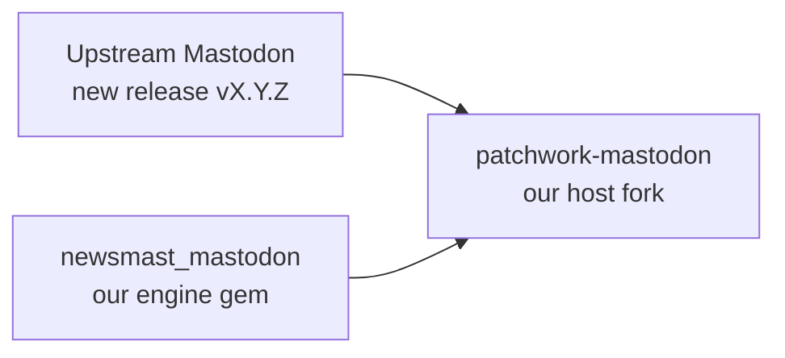

# Internal Guide — Upgrading `newsmast_mastodon` for a New Mastodon Version

> **Audience: internal maintainers only.** This document is for the team that
> develops and releases the `newsmast_mastodon` engine gem. It explains how to
> upgrade the gem so it stays compatible with a **new upstream Mastodon
> version**. It is **not** a guide for downstream consumers upgrading the gem
> dependency in their own app.

A friendly, walk-through companion to the
[`RUNBOOK.md`](./RUNBOOK.md).
The runbook is the precise, checklist-driven **source of truth**; this guide
explains the *why* and the *mental model* so a new team member can run an
upgrade with confidence.

> **TL;DR** We upgrade two repos together: the host fork
> (`patchwork-mastodon`) and the engine gem (`newsmast_mastodon`). The gem is
> **released first**, then the host pins that exact released version. Never ship
> a production deploy that points at a git branch.

---

## 1. The big picture

We maintain a fork of Mastodon plus a gem that carries all of our custom
behavior. Upgrading means pulling in a new upstream Mastodon release **without
losing our customizations**.



- **`patchwork-mastodon` (host):** our fork of the real Mastodon app. It merges
  the new upstream release and *consumes* the gem.
- **`newsmast_mastodon` (gem):** an engine gem that holds our customizations —
  migrations, prepended concerns, services, and vendored frontend overrides. It
  defines the **compatibility contract** that says which Mastodon version it
  targets.

### Why two repos, and why this order?

The gem declares which Mastodon version it supports
(`mastodon_version_requirement`). If the host upgraded first and pinned a gem
that wasn't ready, the two would drift apart and break at boot. So the rule is:

1. Get the new upstream code into the host.
2. Make the gem compatible on a dev branch.
3. **Release the gem** (tag + publish to RubyGems).
4. Host pins the *exact* released gem version and ships.

---

## 2. Key concepts you need to understand first

| Concept | What it means | Where it lives |
| --- | --- | --- |
| **Compatibility contract** | The gem's declared target Mastodon version. Must match the host's actual version at boot. | `newsmast_mastodon.gemspec`, `lib/newsmast_mastodon/version.rb` |
| **Exact version pin** | Production host always pins `gem "newsmast_mastodon", "X.Y.Z.N"` — never a branch. | `patchwork-mastodon/Gemfile` |
| **Temporary branch source** | During development only, the host may point at the gem's dev branch. Must be removed before staging. | `patchwork-mastodon/Gemfile` |
| **Idempotent migrations** | Gem migrations must be safe to run even if upstream already added the column/table (`if_not_exists`, `column_exists?`). | gem `db/migrate/` |
| **Vendored overrides** | The gem ships copies of some upstream frontend/view files. If upstream changes them, our copies must be re-based or they silently regress. | gem frontend overrides |

---

## 3. Before you start (pre-flight)

Make sure you have:

- [ ] Clean working trees in **both** repos (`git status`).
- [ ] The `upstream` remote configured on the host pointing at the official
      Mastodon repo.
- [ ] A **database backup** of staging before any migration.
- [ ] Credentials/env needed to boot, migrate, and run tests in both repos.
- [ ] Green gem CI on `main`.

Then copy the **Release intake** block from the runbook into a new report file
at `docs/internal/mastodon-upgrade/reports/report-<TO_VERSION>.md` and fill in
the version numbers. You'll
check items off in *your copy*, not in the runbook template.

---

## 4. The upgrade, phase by phase

The runbook breaks the work into lettered phases. Here's what each one is *for*,
in plain language. Follow the exact commands in the
[runbook](./RUNBOOK.md) — this section is the map, not
the territory.

### Phase A & B — Bring upstream into the host

Branch the host off the current base, then merge the new upstream tag
(`git merge vX.Y.Z`). Expect conflicts. Resolve them carefully, paying special
attention to:

- `Gemfile` / `Gemfile.lock`
- `config/initializers/devise.rb`
- `lib/mastodon/version.rb` (must end up reporting the new version)
- anything in `patchwork-mastodon/CONFLICT_CHECKLIST.md`

> 💡 **Tip:** The conflict checklist is your friend. Regenerate it for the new
> range so you don't miss a hot-spot file.

### Phase C — Make the gem compatible (dev branch)

Branch the gem off `main` (`mastodon-X.Y.Z`) and update the **compatibility
contract** in four places that must all agree:

1. `lib/newsmast_mastodon/version.rb`
2. `newsmast_mastodon.gemspec` (`mastodon_version_requirement`)
3. `README.md` compatibility section
4. `CHANGELOG.md`

Run the sync check to prove they agree:

```bash
bundle exec rspec spec/compatibility/version_sync_spec.rb
```

Then fix any patched concerns/services for upstream API changes, guard your
migrations, and **temporarily** point the host Gemfile at the gem dev branch so
you can integrate.

> ⚠️ This branch pointer is **temporary**. It must be replaced with an exact
> version pin before staging (Phase F).

### Phase D — Migrate and boot the host

Run migrations against a **staging clone first**, never production. Watch for
collisions where upstream may now ship a column we used to add ourselves
(e.g. `statuses.local_only`). Install the gem's Chewy indexes and frontend
overrides, then boot and confirm the version:

```bash
bin/rails runner 'puts Mastodon::Version.to_s'
```

A mismatch between the running version and the gem's requirement **warns** in
dev/test and **aborts** in production — that safety net is intentional.

### Phase E — Verification gates

This is where you prove the upgrade works. Run:

- the gem suite standalone,
- the gem suite against the upgraded core (`MASTODON_ROOT=...`),
- the **frontend-override drift check** (`bin/check-override-drift ...`),
- the host core suite,
- and the **manual smoke checklist** (login, OAuth, post create/edit,
  local-only posts, admin, deep links, etc.).

When something fails, classify it: environment issue, upstream regression,
gem-patch regression, or vendored-override drift. The category tells you who
fixes it and where.

### Phase RELEASE — Publish the gem

Only after every Phase E gate is green: open a PR `mastodon-X.Y.Z → main`, merge
on green CI, then tag and push:

```bash
git tag -s vX.Y.Z.N -m "Release vX.Y.Z.N"
git push origin vX.Y.Z.N
```

Confirm it's live on RubyGems. See [`release.md`](./release.md) for details.

### Phase F — Pin and ship to staging (host)

Swap the temporary branch source for the exact released pin:

```ruby
gem "newsmast_mastodon", "X.Y.Z.N"
```

`bundle install`, push the upgrade branch, deploy to staging, re-run the smoke
checklist, and record a go/no-go decision in your report.

### Phase G — Production

Deploy to production once staging passes. Record the deploy time and any issues
in the report.

---

## 5. Things that bite people (high-risk watchlist)

Keep an eye on these every cycle — they're the usual sources of breakage:

- **Auth stack:** Devise / Doorkeeper / session / token changes (the gem
  registers a Doorkeeper password grant).
- **Signature changes** in controllers/services where gem concerns prepend.
- **Model API changes** affecting patched `Status`, `Quote`, `MediaAttachment`,
  `User`, `Account`, `Tag`, `Notification`.
- **Migration collisions** where a gem column now exists in core natively.
- **Vendored frontend/view drift** — always run the drift check.
- **Upstream security hardening** that changes request/URL/federation
  validation.

---

## 6. If it goes wrong (rollback)

Don't panic — the path back is defined:

1. Abandon the upgrade branch if the release is blocked.
2. Restore the database from the pre-migration backup.
3. Re-pin the host Gemfile to the last known-good gem version and
   `bundle install`.
4. Re-point deploy config to the last known-good branch/tag.
5. Record the reason and follow-up tasks in your report.

---

## 7. Quick reference: branch & tag naming

| Repo | Purpose | Pattern | Example |
| --- | --- | --- | --- |
| `newsmast_mastodon` | upgrade dev branch | `mastodon-X.Y.Z` | `mastodon-4.5.12` |
| `newsmast_mastodon` | release tag | `vX.Y.Z.N` | `v4.5.12.0` |
| `patchwork-mastodon` | upgrade branch | `csidnet-X.Y.Z` | `csidnet-4.5.12` |
| `patchwork-mastodon` | deploy branch | `csidnet-X.Y.Z-<stage>` | `csidnet-4.5.12-production` |

Avoid ad-hoc suffixes; feature work goes on short-lived branches that merge into
`mastodon-X.Y.Z` before release.

---

## 8. Where to go next

- **Doing the upgrade?** Work straight through
  [`RUNBOOK.md`](./RUNBOOK.md)
  with your report copy open.
- **Releasing the gem?** See [`release.md`](./release.md).
- **Past cycles for reference?** Browse [`reports/`](./reports/).

Welcome aboard — when in doubt, ask before you push, and never ship a host
deploy that points at a git branch.
