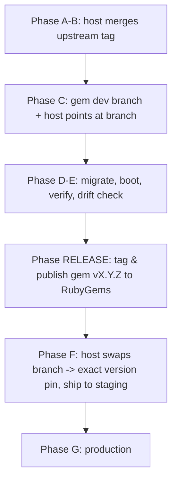

# Internal Runbook — Upgrading `newsmast_mastodon` for a New Mastodon Version

> **Audience: internal maintainers only.** This is for the team that develops
> and releases the `newsmast_mastodon` engine gem. It is **not** a guide for
> downstream consumers upgrading the gem dependency in their own app.

This is the single source of truth for upgrading the host Mastodon fork
(`patchwork-mastodon`) together with the `newsmast_mastodon` engine gem.

> **Why this lives in the gem repo:** the gem defines the compatibility
> contract (`mastodon_version_requirement` metadata, shipped migrations,
> prepended concerns, vendored frontend overrides). The host app only *consumes*
> a released, version-pinned gem. Keeping the runbook next to the contract it
> describes prevents the two from drifting apart.

## How to use this document

1. Copy the **Release intake** block into a new file under
   [`reports/`](./reports/) named `report-<TO_VERSION>.md`.
2. Fill the intake values for the cycle.
3. Work top-to-bottom through the phases, checking items off in your report copy.
4. Leave this template unfilled — it is reused every cycle.

---

## Dependency model (canonical)

The host app pins an **exact, released gem version** — never a floating
constraint and never a long-lived git branch in production:

```ruby
# patchwork-mastodon/Gemfile
gem "newsmast_mastodon", "X.Y.Z"
```

A git `branch:` source is permitted **only** during active upgrade development
(Phase C). It must be replaced with an exact version pin before staging
(Phase F). This matches the gem `README.md` policy and avoids unplanned
compatibility drift.

## Branch & tag naming (canonical)

| Repo                 | Purpose            | Pattern                      | Example                      |
| -------------------- | ------------------ | ---------------------------- | ---------------------------- |
| `newsmast_mastodon`  | upgrade dev branch | `mastodon-X.Y.Z`             | `mastodon-4.5.12`            |
| `newsmast_mastodon`  | release tag        | `vX.Y.Z`                     | `v4.5.12`                    |
| `patchwork-mastodon` | upgrade branch     | `csidnet-X.Y.Z`              | `csidnet-4.5.12`             |
| `patchwork-mastodon` | deploy branch      | `csidnet-X.Y.Z-<stage>`      | `csidnet-4.5.12-production`  |

Do not introduce ad-hoc suffixes (e.g. `mastodon-4512-signup`); feature work
belongs on short-lived branches that merge into `mastodon-X.Y.Z` before release.

---

## Release intake (fill before starting — copy into your report)

```
FROM_VERSION:   4.5.11
TO_VERSION:     <e.g. 4.5.12>
TARGET_TAG:     https://github.com/mastodon/mastodon/releases/tag/v<TO_VERSION>
BASE_BRANCH:    csidnet-<FROM_VERSION>
UPGRADE_BRANCH: csidnet-<TO_VERSION>
CORE_REMOTE:    https://github.com/mastodon/mastodon.git
GEM_REPO:       https://github.com/patchwork-hub/newsmast_mastodon
GEM_DEV_BRANCH: mastodon-<TO_VERSION>
GEM_VERSION:    <TO_VERSION>   # released gem version pinned by the host
```

## What to collect for each release

- [ ] Release-notes delta for `FROM_VERSION -> TO_VERSION`.
- [ ] Count and names of upstream core migrations introduced in the range.
- [ ] Major dependency jumps (especially the auth/session stack).
- [ ] API/signature changes that may affect prepended/included concerns.
- [ ] Upstream changes to any file the gem **vendors** (see Phase E drift check).
- [ ] Estimated risk summary for this cycle.

---

## Coordinated release sequence (read first)

The upgrade spans two repos and must happen in this order:



The gem is **released first**; the host then pins the released version. Never
ship a host deploy that points at a git branch.

---

## Pre-flight

- [ ] Clean working tree in both repos: `git status`.
- [ ] `upstream` remote on the host matches `CORE_REMOTE`.
- [ ] Backup the staging database before any migration.
- [ ] Credentials/env available for boot, migration, and test runs in both repos.
- [ ] Gem CI is green on `main` before starting.

## Phase A — Branch and fetch (host)

```bash
cd patchwork-mastodon
git checkout <BASE_BRANCH>
git checkout -b <UPGRADE_BRANCH>
git fetch upstream --tags
```

## Phase B — Merge target tag (host)

```bash
git merge v<TO_VERSION> --no-commit --no-ff
```

Resolve conflicts, prioritizing:

- `Gemfile` / `Gemfile.lock`
- `config/initializers/devise.rb`
- `lib/mastodon/version.rb`
- any file listed in `patchwork-mastodon/CONFLICT_CHECKLIST.md`

Then:

- [ ] Confirm `lib/mastodon/version.rb` reports `TO_VERSION`.
- [ ] Regenerate `CONFLICT_CHECKLIST.md` for this release range.
- [ ] Commit the merge.

## Phase C — Gem changes & temporary wiring

1. In the gem, branch from `main`:

   ```bash
   cd newsmast_mastodon
   git checkout main && git pull --ff-only
   git checkout -b mastodon-<TO_VERSION>
   ```

2. Update the compatibility contract:

   - [ ] `lib/newsmast_mastodon/version.rb` → `VERSION = "<TO_VERSION>"`
   - [ ] `newsmast_mastodon.gemspec` → `mastodon_version_requirement = "<TO_VERSION>"`
   - [ ] `README.md` compatibility section
   - [ ] `CHANGELOG.md` (`Unreleased` → new section)

   Run the sync check to confirm all four agree:

   ```bash
   bundle exec rspec spec/compatibility/version_sync_spec.rb
   ```

3. Update patched concerns/services for any upstream API/signature changes.
4. Guard every gem migration (see Phase D). Run:

   ```bash
   bundle exec rspec spec/compatibility/migration_guard_spec.rb
   ```

5. **Temporarily** point the host Gemfile at the dev branch for integration:

   ```ruby
   gem "newsmast_mastodon",
       git: "https://github.com/patchwork-hub/newsmast_mastodon",
       branch: "mastodon-<TO_VERSION>"
   ```

   ```bash
   cd ../patchwork-mastodon && bundle install
   ```

## Phase D — Database and boot (host)

1. Apply migrations against a **staging clone first**:

   ```bash
   bin/rails db:migrate
   ```

2. Confirm no collision with columns that upstream may now ship natively:
   - `status_edits.quote_id`
   - `statuses.fetched_replies_at`
   - `statuses.local_only`
   - `announcements.notification_sent_at`

   All gem migrations must be idempotent (`if_not_exists` / `column_exists?` /
   `table_exists?`); the `migration_guard_spec` enforces this in CI.

3. Install gem-shipped Chewy indexes and frontend overrides:

   ```bash
   bin/rails newsmast_mastodon:install
   yarn build:development   # or build:production
   ```

4. Verify boot and version:

   ```bash
   bin/rails runner 'puts Mastodon::Version.to_s'
   ```

   Watch the log for the gem's runtime compatibility assertion. A mismatch
   between `Mastodon::Version` and the gem's `mastodon_version_requirement`
   warns in development/test and **aborts** in production.

## Phase E — Verification gates

1. Gem suite (standalone):

   ```bash
   cd newsmast_mastodon && bundle exec rspec
   ```

2. Gem suite against the upgraded core (host mode):

   ```bash
   MASTODON_ROOT=/absolute/path/to/patchwork-mastodon bundle exec rspec
   ```

3. **Frontend-override drift check** — the gem vendors copies of upstream files
   (e.g. `compose_form.jsx`, `detailed_status.tsx`, `reducers/compose.js`,
   `admin/shared/_status.html.haml`). If upstream changed any of them in this
   range, the vendored copy must be re-based or the override will silently
   regress:

   ```bash
   bin/check-override-drift /absolute/path/to/patchwork-mastodon
   ```

4. Concern/prepend ordering boot check — confirm no `already defined` /
   `NoMethodError` from `config/initializers/prepend_concerns.rb`.

5. Host core suite:

   ```bash
   cd patchwork-mastodon && bundle exec rspec
   ```

6. Manual smoke checklist:
   - [ ] Login / session
   - [ ] OAuth token issuance (Doorkeeper password grant)
   - [ ] Password change / reset flow
   - [ ] Post create / edit / draft flow
   - [ ] Local-only post behavior
   - [ ] Custom feeds / timelines
   - [ ] Banned-keyword filtering
   - [ ] Admin authentication / dashboard
   - [ ] Deep links (`apple-app-site-association`, `assetlinks.json`)

7. Classify any failure as:
   - [ ] Environment/infrastructure (missing services, credentials, tooling)
   - [ ] Upgrade regression in the core merge
   - [ ] Regression in patched gem behavior
   - [ ] Vendored-override drift

## Phase RELEASE — Publish the gem

Only after all Phase E gates pass on the gem dev branch:

1. Open a PR `mastodon-<TO_VERSION>` → `main`; require green CI.
2. Merge, then release per [`release.md`](./release.md):

   ```bash
   git checkout main && git pull --ff-only
   git tag -s v<TO_VERSION> -m "Release v<TO_VERSION>"
   git push origin v<TO_VERSION>
   ```

3. Confirm the version is live on RubyGems.

## Phase F — Pin & ship to staging (host)

1. Replace the temporary branch source with the released, exact pin:

   ```ruby
   gem "newsmast_mastodon", "<TO_VERSION>"
   ```

   ```bash
   bundle install
   ```

2. Commit, push `<UPGRADE_BRANCH>`, deploy `csidnet-<TO_VERSION>-staging`.
3. Re-run the smoke checklist in staging.
4. Record the go/no-go decision in your report.

## Phase G — Production

1. Deploy `csidnet-<TO_VERSION>-production` once staging passes.
2. Record deployment time and any issues in the report.

---

## High-risk watchlist (every release)

- [ ] Auth stack: Devise / Doorkeeper / session strategy / token flow changes
      (the gem registers a Doorkeeper password grant in `engine.rb`).
- [ ] Controller/service signature changes where gem concerns prepend/override.
- [ ] Model API changes affecting patched `Status`, `Quote`, `MediaAttachment`,
      `User`, `Account`, `Tag`, `Notification` concerns.
- [ ] Serializer/autoload constant changes that break gem namespace loading.
- [ ] Migration collisions where gem columns may already exist in core schema.
- [ ] Upstream changes to any **vendored** frontend/view file (drift check).
- [ ] Upstream security hardening that changes request validation, federation,
      or URL checks.

## Rollback

- [ ] Abandon `<UPGRADE_BRANCH>` if the release is blocked.
- [ ] Restore the database from the pre-migration backup snapshot.
- [ ] Re-pin the host Gemfile to the last known-good gem version and `bundle install`.
- [ ] Re-point deploy configuration to the last known-good branch/tag.
- [ ] Record the rollback reason and remediation tasks in the report.
